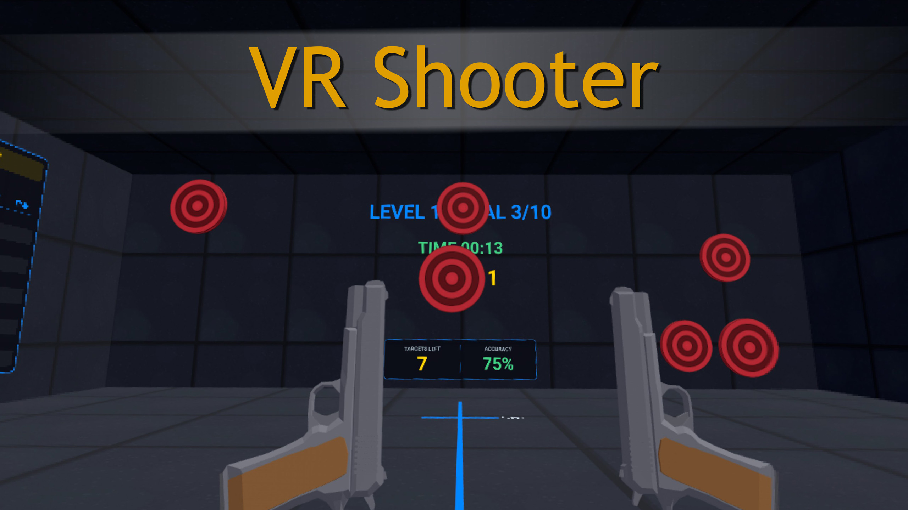

# VR Shooting Range



## 🎮 [▶ PLAY NOW — netkot.github.io/vr-shooter](https://netkot.github.io/vr-shooter/)

> Open the link on a **Meta Quest** (Meta Browser → **Enter VR**) or in any desktop browser to try it instantly — no install needed.

A WebXR shooting-range game for the Meta Quest (and any WebXR headset), built with
[A-Frame](https://aframe.io/) 1.7. You stand in a long concrete range with a pistol in
each hand, shoot the **START** disc to begin, and clear waves of bullseye targets across
ten escalating levels. No build step, no bundler — just static HTML, JS and assets served
over HTTPS.

---

## Quick description

Shoot the green **START** target to begin. Targets pop up on the far wall; hit them to
fill the level goal. Each level the targets get smaller and respawn faster. Score more by
shooting **fast** (a reaction-time bonus) and from **far away** (a distance bonus). Clear
all 10 levels for **GAME OVER**, with your final score, accuracy and time — and your best
run saved as a persistent **High Score**. Shoot the **RELOAD** disc on the right wall at
any time to restart fresh.

---

## Full description

### Goal & flow

- **Start:** the scene opens on a "SHOOT START" screen. Shoot the green START disc in the
  top-left of the front wall to begin. A random background music track starts with it.
- **Levels:** each level asks you to destroy a fixed number of targets (the **goal**,
  configurable, default 10). Clearing it advances you to the next level with a "LEVEL N"
  banner and a rising arpeggio.
- **Difficulty curve:** with each level, targets **shrink uniformly** (from a large radius
  on level 1 to a small one on the last) and **respawn faster**. There is one target type
  (red bullseye, 1 HP) — the challenge comes from size, speed and your own aim.
- **Victory:** clearing the last level (default 10) ends the game with a **GAME OVER**
  banner showing final **score**, **accuracy** and **time**. After a short pause the START
  target reappears so you can play again.

### Scoring

Each destroyed target awards points from the formula:

```
score = base × timeMultiplier × distanceMultiplier
```

- **base** — points per hit (default 50).
- **timeMultiplier (×1…×2)** — the faster you destroy a target after it appears, the
  bigger the bonus. An instant hit is ×2; after the reaction window (default 2.5 s) it
  settles to ×1.
- **distanceMultiplier (×0.5…×3)** — farther shots score more. A shot at the reference
  distance (default 10 m) is ×1, clamped to the configured min/max.

So **speed + distance = high score**. The numbers shown on the in-world RULES & SCORING
board are generated from the live config, so the explanation always matches the actual
balance.

### High score

Your best total is stored in `localStorage` and shown as a ★ HIGH SCORE banner above the
level-stats table. Beating it during a run flashes **NEW HIGH SCORE!** on the GAME OVER
screen. It survives reloads and sessions (and degrades gracefully if storage is disabled).

### Controls

- **Trigger (either hand)** — fire that hand's pistol, with a **haptic kick** on that
  controller. Both hands hold a pistol, so you can dual-wield.
- **Left thumbstick** — move around the range, relative to where you're looking.
- **Right thumbstick** — snap-turn in 30° steps.
- **Desktop (no headset)** — click the mouse to fire, for quick testing in a browser.

### The world

- A long concrete range (doubled in length so you can back up for longer-distance shots)
  with procedurally textured floor, walls and ceiling — no image files, drawn on canvas
  and tiled on the GPU (cheap for Quest).
- **Floor distance markings** — a dashed center line with 5 m / 10 m / 15 m labels to the
  target wall, so you can read your shooting distance.
- **HUD on the front wall** — current LEVEL and GOAL, elapsed TIME, plus a large combat
  panel showing **TARGETS LEFT** and live **ACCURACY** (color-coded).
- **Stats table (left wall)** — one row per cleared level: hits/shots, accuracy, score and
  time, topped by the all-time high score.
- **Rules board (right wall)** — how to play and how scoring works, generated from config.

### Feedback & effects

- **Spatial audio** (Web Audio API, HRTF-panned to your head): pistol shots, target
  impacts, ringing casings, muffled concrete wall hits, and a level-up arpeggio. Real mp3
  samples are used when loaded, with on-the-fly synthesis as a fallback so the game is
  never silent.
- **Haptics** — each shot pulses the firing hand's controller. The gamepad is resolved
  live per shot rather than cached, so both controllers vibrate reliably even after a hand
  disconnects and reconnects on Quest.
- **Background music** — one random track per game, fading out smoothly on GAME OVER.
- **Visuals** — muzzle flash, glowing tracers, ejected brass casings that bounce and ring,
  flying debris with gravity, and persistent **bullet holes** punched into the walls and
  floor on a miss (capped, with old ones recycled).

---

## Running it

This is a static site — no build. It just needs to be served over **HTTPS** (WebXR
requires a secure context), and opened in a WebXR-capable browser.

1. Serve the `www/` folder from any HTTPS web server. (This project lives under an
   [OSPanel](https://ospanel.io/) document root; any static HTTPS host works.)
2. On a **Meta Quest**, open the URL in the Oculus/Meta Browser and tap **Enter VR**.
3. On **desktop**, open the URL in a browser to preview and test with the mouse.

A-Frame loads from a CDN with a local fallback. `config.js` and `game.js` are always loaded
with a fresh cache-busting token, so a plain refresh (or shooting **RELOAD**) always picks
up the current version rather than a stale cache — important on Quest, which caches
aggressively.

---

## Configuration

Most gameplay knobs live in [`config.js`](config.js) and are read at load time. Edit the
values, then **reload** the scene to apply them (shooting RELOAD busts the cache). Missing
or mistyped keys fall back to safe built-in defaults, so a typo won't crash the game.

| Section | Key | Meaning | Default |
|---|---|---|---|
| `audio` | `masterVolume` | Sound-effects volume | `0.5` |
| | `musicVolume` | Background-music volume | `0.5` |
| | `musicTrackCount` | How many `bg_NN.mp3` tracks exist in `music/` | `20` |
| `levels` | `baseKills` | Targets to destroy on level 1 | `10` |
| | `killsStep` | Added to the goal each level (`0` = constant) | `0` |
| | `maxLevel` | Clear this level to win | `10` |
| | `bigRadius` | Target radius on level 1 (large) | `0.4` |
| | `smallRadius` | Target radius on the last level (small) | `0.18` |
| `targets` | `respawn` | ms before a destroyed target reappears | `1200` |
| | `health` | Hits needed to destroy a target | `1` |
| `scoring` | `base` | Base points per hit | `50` |
| | `reactFull` | ms reaction window for the speed bonus | `2500` |
| | `distRef` | Distance (m) giving a ×1 multiplier | `10` |
| | `distMin` / `distMax` | Distance-multiplier bounds | `0.5` / `3.0` |
| `game` | `restartDelayMs` | Pause before START reappears after GAME OVER | `5000` |
| | `highScoreKey` | `localStorage` key for the high score | `vr-shooter-highscore` |
| | `maxBulletHoles` | Max simultaneous bullet marks on surfaces | `100` |

Finer aim/visual calibration (pistol rotation, beam pitch, casing ejection, tracer rise) is
intentionally **not** exposed in `config.js` and lives in `game.js`.

---

## Project layout

```
www/
├── index.html      Scene markup: room, lighting, HUD, targets, player rig & pistols
├── config.js       Gameplay settings (loaded BEFORE game.js)
├── game.js         All components & logic: shooting, scoring, levels, targets,
│                   audio, effects, HUD/boards, locomotion
├── models/
│   └── pistol.glb  Pistol model (Quaternius, CC0)
├── sfx/            Shot / impact / casing samples (mp3)
└── music/          Background tracks bg_01.mp3 … bg_NN.mp3
```

### Tech

- **A-Frame 1.7** on **three.js r173** — pure entity-component, no framework build.
- **Web Audio API** for spatial sound; **Canvas** for all textures and text (the stock
  MSDF font is bypassed via canvas-drawn text), so there are no image assets to ship.

---

## Credits

- Pistol model: **Quaternius** (CC0).
- Built with **A-Frame** / **three.js**.
